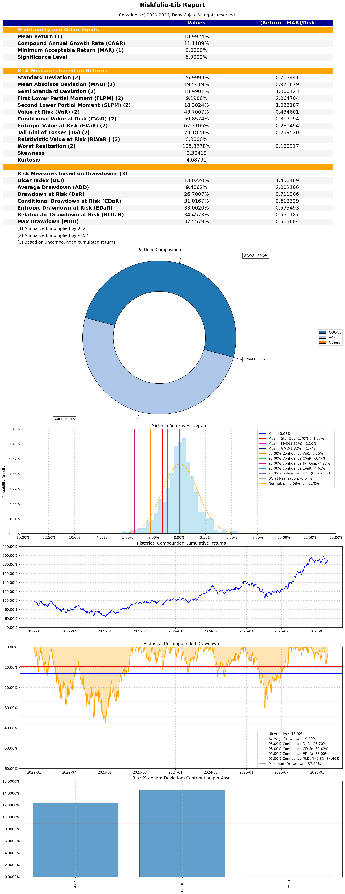
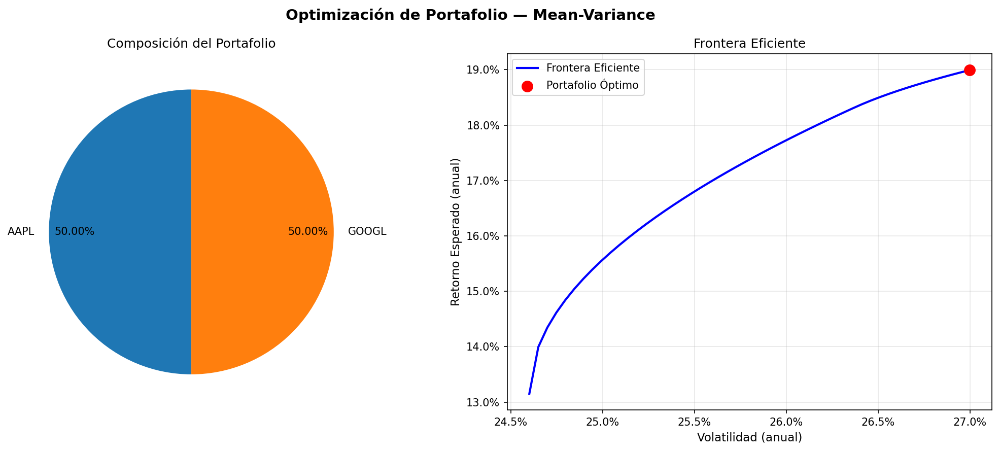

# Agente de Optimización de Portafolios

Herramienta para optimización de portafolios financieros con el modelo **Mean-Variance de Markowitz**. Descarga precios históricos desde Yahoo Finance, optimiza la asignación de activos con Riskfolio-Lib y ofrece dos formas de interacción: una CLI directa y un agente conversacional impulsado por **qwen3.5** vía Ollama.

---

## Tabla de contenidos

1. [Estructura del proyecto](#estructura-del-proyecto)
2. [Requisitos](#requisitos)
3. [Instalación](#instalación)
4. [Uso sin LLM — CLI directa (`agent.py`)](#uso-sin-llm--cli-directa-agentpy)
   - [Modo optimización](#modo-optimización)
   - [Modo portafolio propio desde Excel](#modo-portafolio-propio-desde-excel)
     - [Submodo analizar](#submodo-analizar)
     - [Submodo optimizar](#submodo-optimizar)
5. [Uso con LLM — Agente conversacional (`chat.py`)](#uso-con-llm--agente-conversacional-chatpy)
6. [Módulos internos](#módulos-internos)
7. [Referencia de parámetros](#referencia-de-parámetros)

---

## Estructura del proyecto

```
Riskfolio/
├── agent.py              # CLI de optimización directa (sin LLM)
├── chat.py               # Agente conversacional con qwen3.5 vía Ollama
├── requirements.txt      # Dependencias del proyecto
└── src/
    ├── __init__.py
    ├── data.py           # Descarga de precios con yfinance
    ├── optimizer.py      # Optimización Mean-Variance con Riskfolio-Lib
    ├── report.py         # Gráficos y exportación Excel
    └── llm.py            # Integración con Ollama y definición de herramientas
```

---

## Requisitos

- **Python** 3.11+
- **Ollama** corriendo localmente en `http://localhost:11434` (solo para `chat.py`)
- Modelo **`qwen3.5:latest`** instalado en Ollama

Para instalar el modelo en Ollama (si no está instalado):

```bash
ollama pull qwen3.5
```

---

## Instalación

### 1. Crear y activar el entorno virtual

```bash
# Crear entorno con Python 3.11
py -3.11 -m venv venv

# Activar en Windows
venv\Scripts\activate

# Activar en Linux/macOS
source venv/bin/activate
```

### 2. Instalar dependencias

```bash
pip install -r requirements.txt
```

---

## Uso sin LLM — CLI directa (`agent.py`)

`agent.py` ofrece **tres modos de operación** que se excluyen mutuamente:

| Modo | Cuándo usarlo | Outputs |
|---|---|---|
| **Optimización** (`--tickers`) | Tienes los tickers y quieres obtener la asignación óptima descargando datos de Yahoo Finance | 4 archivos |
| **Portafolio propio — analizar** (`--portfolio-excel`) | Ya tienes precios y pesos en Excel y quieres ver métricas sin modificar la composición | 2 archivos |
| **Portafolio propio — optimizar** (`--portfolio-excel --optimize`) | Tienes precios históricos en Excel y quieres calcular la asignación óptima y la frontera eficiente | 4 archivos |

---

### Modo optimización

Descarga precios desde Yahoo Finance y calcula la asignación óptima de activos.

```bash
python -X utf8 agent.py --tickers T1 T2 ... --start YYYY-MM-DD [opciones]
```

> El flag `-X utf8` es necesario en Windows para el correcto manejo de caracteres especiales.

> **Resultados guardados automáticamente**: sin necesidad de indicar flags de exportación, cada ejecución genera los 4 archivos de salida en `resultados/`. Usa `--export-excel` y `--save-plot` para cambiar la ruta de destino.

### Ejemplos de optimización

**Portafolio tecnológico con máximo Sharpe (default):**

```bash
python -X utf8 agent.py \
  --tickers AAPL MSFT GOOGL AMZN META \
  --start 2022-01-01 \
  --end 2024-12-31
```

**Minimizar riesgo con tasa libre del 5%:**

```bash
python -X utf8 agent.py \
  --tickers AAPL MSFT GOOGL AMZN META \
  --start 2022-01-01 \
  --end 2024-12-31 \
  --objective min_risk \
  --rf 0.05
```

**Optimización con CVaR, retornos logarítmicos y exportación a Excel:**

```bash
python -X utf8 agent.py \
  --tickers JPM BAC GS MS WFC \
  --start 2021-01-01 \
  --end 2024-12-31 \
  --objective sharpe \
  --risk-measure CVaR \
  --returns-method log \
  --export-excel resultados/portafolio_bancos.xlsx
```

> Genera en `resultados/`: `portafolio_bancos.xlsx` (pesos, métricas y retornos), `riskfolio_report.xlsx` (reporte completo de Riskfolio-Lib con 8 hojas) y `jupyter_report.png` (reporte visual con 5 paneles). Sin `--export-excel`, los archivos se guardan igualmente en `resultados/` con el nombre `portafolio.xlsx`.

**Guardar gráficos sin mostrarlos en pantalla:**

```bash
python -X utf8 agent.py \
  --tickers NVDA AMD INTC TSM \
  --start 2023-01-01 \
  --end 2024-12-31 \
  --save-plot resultados/ \
  --no-plot
```

**Permitir posiciones cortas (long-short):**

```bash
python -X utf8 agent.py \
  --tickers AAPL MSFT GOOGL AMZN TSLA \
  --start 2022-01-01 \
  --end 2024-12-31 \
  --allow-short
```

**Limitar la concentración máxima por activo al 30%:**

```bash
python -X utf8 agent.py \
  --tickers AAPL MSFT NVDA GOOGL AMZN META \
  --start 2022-01-01 \
  --end 2024-12-31 \
  --max-weight 0.30
```

### Salida en consola

```
=======================================================
  AGENTE DE OPTIMIZACIÓN — MEAN-VARIANCE
=======================================================
  Objetivo      : sharpe
  Medida riesgo : MV
  Tasa libre    : 0.00%
  Peso max/activo: 50%
  Solo largo    : True
  Período       : 2022-01-01 a 2026-02-27
=======================================================

[INFO] Descargando datos para: AAPL, MSFT, GOOGL, AMZN, META
[INFO] Activos válidos (5): AAPL, AMZN, GOOGL, META, MSFT
[INFO] Observaciones: 752 filas

=======================================================
  PORTAFOLIO ÓPTIMO — ASIGNACIÓN DE PESOS
=======================================================
  Activo    Peso (%)
  -------------------
  AAPL       55.0123
  META       44.9877
  -------------------
  TOTAL     100.0000

=======================================================
  MÉTRICAS (ANUALIZADAS)
=======================================================
  Retorno Esperado (anual)          0.2225
  Volatilidad (anual)               0.3213
  Sharpe Ratio                      0.6925
=======================================================
```

### Archivos generados (modo optimización)

Cada ejecución genera 4 archivos en `resultados/` (o en la carpeta indicada):

| Archivo | Descripción |
|---|---|
| `portafolio.xlsx` | Pesos óptimos, métricas anualizadas y retornos históricos (3 hojas) |
| `riskfolio_report.xlsx` | Reporte completo de Riskfolio-Lib: CAGR, Sharpe, VaR, CVaR, EVaR, MaxDrawdown, retornos acumulados, drawdowns (8 hojas) |
| `jupyter_report.png` | Reporte visual con 5 paneles: tabla de métricas, composición (pie), histograma de retornos, drawdown y contribución al riesgo por activo |
| `portfolio_optimization.png` | Pie chart de composición y gráfico de frontera eficiente |

<div align="center">
    
    
</div>

---

### Modo portafolio propio desde Excel

Permite trabajar con datos locales: un archivo Excel con la hoja `Precios` (y opcionalmente `Pesos`). Ofrece dos submodos:

| Submodo | Flag | Requiere hojas | Outputs |
|---|---|---|---|
| **Analizar** | `--portfolio-excel` | `Precios` + `Pesos` | `riskfolio_report.xlsx`, `jupyter_report.png` |
| **Optimizar** | `--portfolio-excel --optimize` | Solo `Precios` | 4 archivos (igual que modo optimización) |

#### Formato del Excel de entrada

##### Hoja `Precios` (requerida en ambos submodos)

| Date | AAPL | MSFT | GOOGL |
|---|---|---|---|
| 2022-01-03 | 182.01 | 333.46 | 2893.59 |
| 2022-01-04 | 179.70 | 329.51 | 2840.27 |
| ... | ... | ... | ... |

Primera columna = fechas (índice), columnas restantes = precio de cierre de cada instrumento.

##### Hoja `Pesos` (solo requerida para el submodo analizar)

| Ticker | Peso |
|---|---|
| AAPL | 0.50 |
| MSFT | 0.30 |
| GOOGL | 0.20 |

Primera columna = tickers (índice), segunda columna = pesos entre 0 y 1.

---

#### Submodo analizar

Usa los pesos definidos en la hoja `Pesos` tal como están. No ejecuta ninguna optimización.

```bash
python -X utf8 agent.py --portfolio-excel FILE.xlsx [--rf TASA] [--save-plot DIR]
```

**Ejemplo básico:**

```bash
python -X utf8 agent.py --portfolio-excel mi_cartera.xlsx
```

**Con tasa libre del 4% y carpeta de salida personalizada:**

```bash
python -X utf8 agent.py \
  --portfolio-excel mi_cartera.xlsx \
  --rf 0.04 \
  --save-plot mis_resultados/
```

**Salida en consola:**

```
=======================================================
  ANÁLISIS DE PORTAFOLIO DESDE EXCEL
=======================================================
  Archivo       : mi_cartera.xlsx
  Tasa libre    : 4.00%
  Carpeta salida: resultados/
=======================================================

[INFO] Portafolio cargado desde: mi_cartera.xlsx
[INFO] Activos (3): AAPL, MSFT, GOOGL
[INFO] Observaciones: 751 filas de retornos

[INFO] Reporte Riskfolio guardado en: resultados\riskfolio_report.xlsx
[INFO] Reporte visual Riskfolio guardado en: resultados\jupyter_report.png

[OK] Reportes generados en: resultados/
```

**Archivos generados:**

| Archivo | Descripción |
|---|---|
| `riskfolio_report.xlsx` | Reporte completo de Riskfolio-Lib (8 hojas: métricas de riesgo/retorno, retornos acumulados, drawdowns, etc.) |
| `jupyter_report.png` | Reporte visual con 5 paneles: tabla de métricas, composición (pie), histograma de retornos, drawdown y contribución al riesgo por activo |

---

#### Submodo optimizar

Usa solo la hoja `Precios` para calcular los retornos y ejecutar la optimización Mean-Variance. Genera los mismos 4 archivos que el modo optimización estándar, incluyendo la frontera eficiente. La hoja `Pesos` (si existe) es ignorada.

Acepta todos los parámetros de optimización: `--objective`, `--risk-measure`, `--rf`, `--allow-short`, `--max-weight`.

```bash
python -X utf8 agent.py --portfolio-excel FILE.xlsx --optimize [opciones de optimización] [--save-plot DIR]
```

**Ejemplo básico:**

```bash
python -X utf8 agent.py --portfolio-excel mi_cartera.xlsx --optimize
```

**Maximizar Sharpe con tasa libre del 4%:**

```bash
python -X utf8 agent.py \
  --portfolio-excel mi_cartera.xlsx \
  --optimize \
  --objective sharpe \
  --rf 0.04 \
  --save-plot mis_resultados/
```

**Minimizar riesgo limitando la concentración al 30% por activo:**

```bash
python -X utf8 agent.py \
  --portfolio-excel mi_cartera.xlsx \
  --optimize \
  --objective min_risk \
  --max-weight 0.30 \
  --no-plot
```

**Salida en consola:**

```
=======================================================
  OPTIMIZACIÓN DESDE EXCEL — MEAN-VARIANCE
=======================================================
  Archivo       : mi_cartera.xlsx
  Objetivo      : sharpe
  Medida riesgo : MV
  Tasa libre    : 4.00%
  Peso max/activo: 50%
  Solo largo    : True
  Carpeta salida: resultados/
=======================================================

[INFO] Precios cargados desde: mi_cartera.xlsx
[INFO] Activos (3): AAPL, GOOGL, MSFT
[INFO] Observaciones: 751 filas de retornos

[INFO] Ejecutando optimización...

=======================================================
  PORTAFOLIO ÓPTIMO — ASIGNACIÓN DE PESOS
=======================================================
  Activo     Peso (%)
  --------------------
  AAPL        50.0000
  GOOGL       30.5617
  MSFT        19.4383
  --------------------
  TOTAL      100.0000

=======================================================
  MÉTRICAS (ANUALIZADAS)
=======================================================
  Retorno Esperado (anual)          0.1455
  Volatilidad (anual)               0.2561
  Sharpe Ratio                      0.4121
=======================================================

[INFO] Resultados exportados a: resultados\portafolio.xlsx
[INFO] Reporte Riskfolio guardado en: resultados\riskfolio_report.xlsx
[INFO] Reporte visual Riskfolio guardado en: resultados\jupyter_report.png
[INFO] Gráfico guardado en: resultados\portfolio_optimization.png

[OK] Reportes generados en: resultados/
```

**Archivos generados:**

| Archivo | Descripción |
|---|---|
| `portafolio.xlsx` | Pesos óptimos, métricas anualizadas y retornos históricos (3 hojas) |
| `riskfolio_report.xlsx` | Reporte completo de Riskfolio-Lib (8 hojas: CAGR, Sharpe, VaR, CVaR, EVaR, MaxDrawdown, etc.) |
| `jupyter_report.png` | Reporte visual con 5 paneles: tabla de métricas, composición (pie), histograma de retornos, drawdown y contribución al riesgo por activo |
| `portfolio_optimization.png` | Pie chart de composición y gráfico de frontera eficiente |

---

## Uso con LLM — Agente conversacional (`chat.py`)

Interfaz de chat en lenguaje natural. El modelo **qwen3.5** interpreta la solicitud, decide qué herramienta ejecutar, llama a Riskfolio-Lib y devuelve una interpretación financiera en español.

### Requisitos previos

Ollama debe estar corriendo y el modelo instalado:

```bash
# Verificar que Ollama está activo
curl http://localhost:11434/api/tags

# El modelo qwen3.5 debe aparecer en la lista
```

### Iniciar el chat

```bash
python -X utf8 chat.py
```

Con opciones personalizadas:

```bash
python -X utf8 chat.py --model qwen3.5:latest --host http://localhost:11434
```

### Comandos especiales dentro del chat

| Comando | Acción |
|---|---|
| `/reset` | Limpia el historial de conversación |
| `/salir` | Termina el programa |

### Ejemplos de consultas

El agente entiende lenguaje natural en español. No es necesario especificar parámetros técnicos:

```
Tú: Optimiza un portafolio con AAPL, MSFT y GOOGL del año 2023

Tú: Quiero minimizar el riesgo con bancos: JPM, BAC y GS desde 2021

Tú: Compara NVDA y AMD en los últimos 2 años

Tú: Arma un portafolio tech con tasa libre del 5% y guarda los resultados en resultados/

Tú: Muéstrame las estadísticas de TSLA, AMZN y META durante 2024

Tú: Optimiza AAPL MSFT con retornos logarítmicos y medida CVaR

Tú: Ningún activo puede superar el 30% en mi portafolio de NVDA, META, AAPL y GOOGL

Tú: Analiza mi portafolio en cartera.xlsx con tasa libre del 4%

Tú: Genera el reporte de mis posiciones actuales en datos/mi_portafolio.xlsx

Tú: Optimiza mi portafolio usando los precios en datos/cartera.xlsx

Tú: Calcula la frontera eficiente con los datos de mi_cartera.xlsx, objetivo min_risk
```

### Comportamiento por defecto del agente

Cuando el usuario no especifica algún parámetro, el agente asume:

| Parámetro | Valor por defecto |
|---|---|
| Período | Últimos 3 años |
| Objetivo | `sharpe` (máximo Sharpe Ratio) |
| Medida de riesgo | `MV` (varianza) |
| Tasa libre de riesgo | `0.0` |
| Retornos | `simple` (aritméticos) |
| Posiciones cortas | No permitidas |
| Peso máximo por activo | `0.5` (50%) |
| Carpeta de resultados | `resultados/` (siempre se generan los archivos de salida) |

### Herramientas disponibles para el LLM

| Herramienta | Cuándo se activa |
|---|---|
| `optimize_portfolio` | Cuando el usuario pide optimizar, armar o construir un portafolio con tickers descargados de Yahoo Finance |
| `get_price_summary` | Cuando el usuario quiere comparar, explorar o ver estadísticas de activos individuales |
| `analyze_existing_portfolio` | Cuando el usuario indica un archivo Excel local con datos de su portafolio, ya sea para analizar los pesos actuales o para optimizar usando esos precios |

Los resultados se guardan **siempre** en `resultados/` por defecto. Si el usuario indica otra carpeta, el agente la usa como destino.

**`optimize_portfolio`** genera 4 archivos:
- `portafolio.xlsx` — pesos óptimos, métricas y retornos históricos
- `riskfolio_report.xlsx` — reporte completo de Riskfolio-Lib (8 hojas: métricas de riesgo/retorno, retornos acumulados, drawdowns, etc.)
- `jupyter_report.png` — reporte visual con 5 paneles: tabla de métricas, composición (pie), histograma de retornos, drawdown y contribución al riesgo
- `portfolio_optimization.png` — pie chart de composición y frontera eficiente

**`analyze_existing_portfolio`** tiene dos modos seleccionables con el parámetro `optimize`:

Con `optimize=false` (default) — analiza los pesos del Excel tal como están, genera 2 archivos:
- `riskfolio_report.xlsx` — reporte completo de Riskfolio-Lib
- `jupyter_report.png` — reporte visual con 5 paneles

Con `optimize=true` — optimiza usando los precios del Excel, genera los 4 archivos:
- `portafolio.xlsx` — pesos óptimos, métricas y retornos históricos
- `riskfolio_report.xlsx` — reporte completo de Riskfolio-Lib
- `jupyter_report.png` — reporte visual con 5 paneles
- `portfolio_optimization.png` — pie chart de composición y frontera eficiente

> Para el modo `optimize=false` el Excel debe tener las hojas `Precios` y `Pesos`. Para `optimize=true` solo se requiere la hoja `Precios`. Ver el [formato detallado](#formato-del-excel-de-entrada).

---

## Módulos internos

### `src/data.py` — Descarga y carga de datos

| Función | Descripción |
|---|---|
| `download_prices(tickers, start, end, interval)` | Descarga precios de cierre ajustado desde Yahoo Finance. Valida datos mínimos (≥2 activos). |
| `compute_returns(prices, method)` | Calcula retornos `simple` (porcentuales) o `log` (logarítmicos). Elimina NaN. |
| `default_date_range(years)` | Devuelve el rango de fechas por defecto: fin = último día hábil del mes anterior, inicio = `years` años antes. |
| `load_portfolio_from_excel(path)` | Carga un portafolio pre-formado desde un Excel con hojas `Precios` y `Pesos`. Devuelve `(returns, weights)`. Valida que los tickers de pesos existan en precios. |
| `load_prices_from_excel(path)` | Carga solo la hoja `Precios` de un Excel. Devuelve `returns`. Requiere ≥2 activos. Usado por el submodo `--optimize`. |

### `src/optimizer.py` — Optimización Mean-Variance

| Función | Descripción |
|---|---|
| `build_portfolio(returns)` | Crea un objeto `rp.Portfolio` con estadísticas históricas (media y covarianza). |
| `optimize(port, objective, risk_measure, risk_free_rate, long_only)` | Ejecuta la optimización y retorna los pesos óptimos. |
| `compute_metrics(weights, returns, risk_free_rate)` | Calcula retorno esperado, volatilidad y Sharpe Ratio anualizados. |
| `efficient_frontier(port, risk_measure, points)` | Calcula la frontera eficiente con `n` puntos. |

### `src/report.py` — Visualización y exportación

| Función | Descripción |
|---|---|
| `print_weights(weights, metrics)` | Imprime tabla de pesos y métricas en consola. |
| `plot_portfolio(weights, port, risk_measure, output_dir, show)` | Genera pie chart de composición y gráfico de frontera eficiente. |
| `save_to_excel(weights, metrics, returns, output_path)` | Exporta pesos, métricas y retornos históricos a un archivo `.xlsx`. |
| `save_riskfolio_report(weights, returns, output_path, risk_free_rate, alpha)` | Genera el reporte completo de Riskfolio-Lib (`riskfolio_report.xlsx`) con 8 hojas: `Resume` (CAGR, Sharpe, VaR, CVaR, EVaR, MaxDrawdown, etc.), `CumRet`, `Drawdown`, `Returns`, `Portfolios`, `Absdev`, `devBelowTarget`, `devBelowMean`. |
| `save_jupyter_report(weights, returns, output_path, risk_free_rate, alpha, risk_measure)` | Genera el reporte visual de Riskfolio-Lib (`jupyter_report.png`) con 5 paneles: tabla de métricas, composición (pie), histograma de retornos, drawdown y contribución al riesgo por activo. |

### `src/llm.py` — Integración con Ollama

| Componente | Descripción |
|---|---|
| `TOOLS` | Definición JSON de las herramientas disponibles para el modelo. |
| `execute_tool(name, arguments)` | Dispatcher que ejecuta la herramienta indicada por el LLM. |
| `OllamaAgent` | Clase principal. Maneja historial, ciclos de tool calling y respuestas. |
| `OllamaAgent.chat(message)` | Envía un mensaje, ejecuta herramientas si es necesario y retorna la respuesta final. |
| `OllamaAgent.reset()` | Limpia el historial de conversación. |

---

## Referencia de parámetros

### Objetivos de optimización (`--objective`)

| Valor | Descripción |
|---|---|
| `sharpe` | Maximiza el Sharpe Ratio (retorno/riesgo). **Default.** |
| `min_risk` | Minimiza la varianza del portafolio (mínimo riesgo global). |
| `max_ret` | Maximiza el retorno esperado sin restricción de riesgo. |
| `utility` | Maximiza la utilidad cuadrática (parámetro de aversión al riesgo λ=2). |

### Medidas de riesgo (`--risk-measure`)

| Valor | Descripción |
|---|---|
| `MV` | Varianza — medida clásica de Markowitz. **Default.** |
| `MAD` | Mean Absolute Deviation — menos sensible a valores extremos. |
| `CVaR` | Conditional Value at Risk — mide la pérdida esperada en el peor escenario (cola izquierda). |

### Métodos de retorno (`--returns-method`)

| Valor | Descripción |
|---|---|
| `simple` | Retornos aritméticos: `(P_t / P_{t-1}) - 1`. **Default.** |
| `log` | Retornos logarítmicos: `ln(P_t / P_{t-1})`. Más adecuados para períodos largos. |

### Peso máximo por activo (`--max-weight`)

Límite superior de concentración por activo. Impide que el solver asigne todo el peso a un solo ticker.

| Valor | Efecto |
|---|---|
| `0.5` | Ningún activo supera el 50% de la cartera. **Default.** |
| `0.25` | Distribución más diversificada; mínimo 4 activos con peso significativo. |
| `0.1` | Diversificación alta; útil con portafolios de 10+ activos. |
| `1.0` | Sin restricción de concentración (comportamiento original de Markowitz). |

En lenguaje natural el agente interpreta frases como:
- *"ningún activo más del 30%"* → `max_weight=0.3`
- *"máximo 20% por posición"* → `max_weight=0.2`
- *"sin restricción de concentración"* → `max_weight=1.0`
